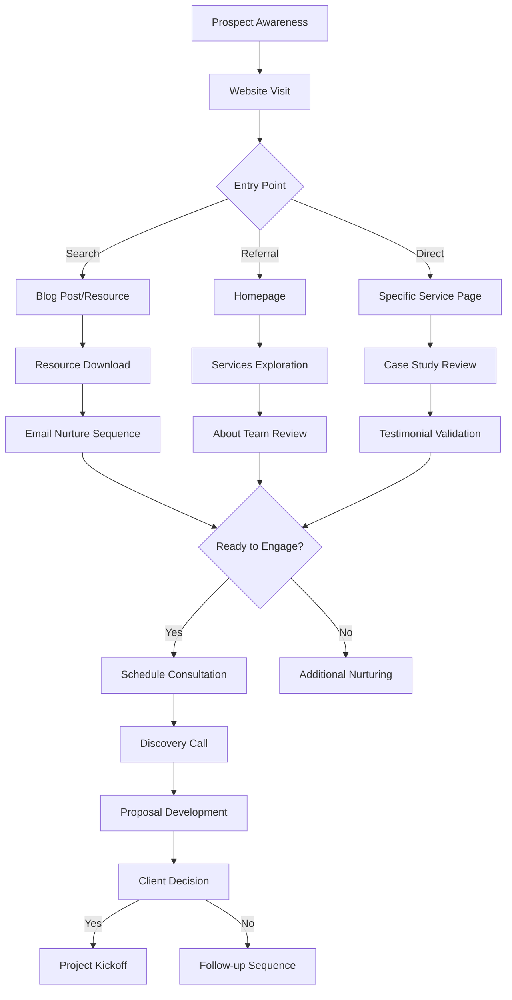

# Consulting Requirements Document
## Business-Specific Requirements for Professional Services Template

### Executive Summary

This document defines the specific requirements for the consulting template within our multi-template website generation platform. Building on our app marketing foundation, this template targets professional service providers who need authority-building, lead-generating websites that convert prospects into clients.

---

## 🎯 Consulting Business Context

### Primary Use Cases
1. **Management Consulting** - Strategy, operations, transformation
2. **Technology Consulting** - Digital transformation, system implementation
3. **Marketing Consulting** - Growth strategy, digital marketing, branding
4. **Financial Consulting** - Corporate finance, M&A, restructuring
5. **HR Consulting** - Organizational development, talent strategy
6. **Independent Consultants** - Subject matter experts, fractional executives

### Target Audience Analysis
```javascript
const consultingAudiences = {
  decisionMakers: {
    titles: ["CEO", "COO", "CFO", "VP", "Director"],
    painPoints: ["Limited internal expertise", "Need for objective perspective", "Resource constraints"],
    goals: ["ROI improvement", "Risk mitigation", "Competitive advantage"]
  },
  influencers: {
    titles: ["Manager", "Senior Analyst", "Team Lead"],
    painPoints: ["Overwhelming workload", "Skill gaps", "Process inefficiencies"],
    goals: ["Career advancement", "Team success", "Learning new skills"]
  },
  procurement: {
    titles: ["Procurement Manager", "Vendor Manager"],
    painPoints: ["Vendor evaluation complexity", "Compliance requirements"],
    goals: ["Cost optimization", "Risk management", "Quality assurance"]
  }
}
```

---

## 🏢 Business Model Requirements

### Service Delivery Models
```javascript
const serviceModels = {
  retainer: {
    name: "Monthly Retainer",
    structure: "Ongoing strategic partnership",
    pricing: "Fixed monthly fee",
    duration: "6-24 months",
    deliverables: "Strategic guidance, regular check-ins"
  },
  project: {
    name: "Project-Based",
    structure: "Defined scope and timeline", 
    pricing: "Fixed fee or time & materials",
    duration: "3-12 months",
    deliverables: "Specific outcomes and reports"
  },
  hourly: {
    name: "Hourly Consulting",
    structure: "Time-based engagement",
    pricing: "$200-$500+ per hour",
    duration: "As needed",
    deliverables: "Expert advice and recommendations"
  },
  fractional: {
    name: "Fractional Executive",
    structure: "Part-time leadership role",
    pricing: "Monthly or equity-based",
    duration: "6-24 months", 
    deliverables: "Executive leadership and strategy"
  }
}
```

### Revenue Optimization Features
```bash
# Lead Generation Focus
□ Contact forms optimized for consultation requests
□ Calendar integration for meeting booking
□ Resource downloads requiring email capture
□ Assessment tools that qualify leads
□ Webinar registration integration

# Authority Building Elements
□ Case study showcase with quantified results
□ Client testimonials with company logos
□ Industry certifications and credentials display
□ Speaking engagements and media mentions
□ Thought leadership content (blog, whitepapers)

# Trust Signal Integration
□ Client logo carousel
□ Industry association memberships
□ Security/compliance certifications
□ Team credentials and LinkedIn integration
□ Awards and recognition display
```

---

## 📊 Consulting Content Strategy

### Content Hierarchy & Purpose
```javascript
const contentStrategy = {
  awareness: {
    purpose: "Attract prospects researching solutions",
    contentTypes: ["Blog posts", "Industry reports", "Trend analysis"],
    keywords: ["Industry + problem", "Best practices", "Market insights"],
    callToAction: "Download guide, Subscribe to newsletter"
  },
  consideration: {
    purpose: "Demonstrate expertise and methodology",
    contentTypes: ["Case studies", "Methodology explanations", "Process guides"],
    keywords: ["Solution + consulting", "How to choose consultant"],
    callToAction: "Request consultation, View case studies"
  },
  decision: {
    purpose: "Convert prospects to clients",
    contentTypes: ["Testimonials", "ROI calculators", "Proposal templates"],
    keywords: ["[Company name] + consulting", "Hire consultant"],
    callToAction: "Schedule call, Request proposal"
  },
  retention: {
    purpose: "Expand existing client relationships",
    contentTypes: ["Client portal", "Additional services", "Renewal content"],
    keywords: ["Expanding engagement", "Additional services"],
    callToAction: "Discuss expansion, Book follow-up"
  }
}
```

### Industry-Specific Content Needs
```javascript
const industryContent = {
  technology: {
    topicsOfExpertise: ["Digital transformation", "Cloud migration", "Cybersecurity"],
    caseStudyFocus: ["Efficiency gains", "Cost savings", "Security improvements"],
    trustSignals: ["Technical certifications", "Technology partnerships"],
    contentTone: "Technical but accessible"
  },
  healthcare: {
    topicsOfExpertise: ["HIPAA compliance", "EHR optimization", "Patient experience"],
    caseStudyFocus: ["Patient outcomes", "Operational efficiency", "Compliance"],
    trustSignals: ["Healthcare credentials", "Regulatory expertise"],
    contentTone: "Professional, compliant, empathetic"
  },
  financial: {
    topicsOfExpertise: ["Regulatory compliance", "Risk management", "M&A"],
    caseStudyFocus: ["ROI", "Risk reduction", "Growth acceleration"],
    trustSignals: ["Financial certifications", "Regulatory experience"],
    contentTone: "Authoritative, risk-conscious"
  },
  manufacturing: {
    topicsOfExpertise: ["Lean operations", "Supply chain", "Industry 4.0"],
    caseStudyFocus: ["Productivity gains", "Quality improvements", "Cost reduction"],
    trustSignals: ["Industry experience", "Operational credentials"],
    contentTone: "Results-focused, practical"
  }
}
```

---

## 🎨 Design & UX Requirements

### Visual Hierarchy for Authority
```css
/* Design principles for consulting sites */
.consulting-design {
  /* Trust and authority through design */
  typography: "Serif headlines for gravitas, sans-serif body for readability";
  colorPalette: "Professional blues, grays, with accent colors for CTAs";
  whitespace: "Generous spacing to convey premium positioning";
  imagery: "Professional photography, authentic team photos, clean illustrations";
  
  /* Conversion optimization */
  ctaPlacement: "Above fold, end of sections, strategic throughout content";
  formDesign: "Multi-step forms to qualify leads while reducing friction";
  socialProof: "Prominent client logos, testimonials, case study metrics";
  mobileExperience: "Touch-friendly, fast loading, thumb-optimized navigation";
}
```

### Page Layout Specifications
```javascript
const consultingLayouts = {
  homepage: {
    sections: [
      "Hero with value proposition",
      "Client logos",
      "Services overview (3-4 main services)",
      "Featured case study",
      "Testimonials",
      "About preview",
      "Blog highlights",
      "Contact CTA"
    ],
    conversionGoals: "Schedule consultation, Download resource"
  },
  services: {
    sections: [
      "Services hero",
      "Service grid with hover details",
      "Process/methodology",
      "Service-specific testimonials", 
      "Related case studies",
      "Service comparison table",
      "Next steps CTA"
    ],
    conversionGoals: "Request service proposal, Schedule service consultation"
  },
  caseStudies: {
    sections: [
      "Case studies overview",
      "Filter by industry/service",
      "Case study cards with metrics",
      "Detailed case study pages",
      "Similar case studies",
      "Discuss your project CTA"
    ],
    conversionGoals: "Request similar engagement, Schedule case discussion"
  },
  about: {
    sections: [
      "Company story and mission",
      "Team member profiles",
      "Company values and approach",
      "Credentials and certifications",
      "Awards and recognition",
      "Client testimonials",
      "Let's work together CTA"
    ],
    conversionGoals: "Meet the team call, Learn about approach"
  }
}
```

---

## 🔄 Client Journey Mapping

### Prospect to Client Conversion Flow


### Touchpoint Requirements
```javascript
const clientTouchpoints = {
  awareness: {
    channels: ["Organic search", "LinkedIn", "Referrals", "Speaking events"],
    content: ["Blog posts", "Industry reports", "Social content"],
    tracking: ["Page views", "Content engagement", "Social shares"],
    goals: ["Brand awareness", "Thought leadership", "SEO improvement"]
  },
  interest: {
    channels: ["Website", "Email", "Social media", "Webinars"],
    content: ["Case studies", "Methodology", "Team bios", "Resources"],
    tracking: ["Time on site", "Pages per session", "Resource downloads"],
    goals: ["Demonstrate expertise", "Build trust", "Generate leads"]
  },
  consideration: {
    channels: ["Email sequences", "Sales calls", "Proposals", "References"],
    content: ["ROI calculators", "Detailed proposals", "Client references"],
    tracking: ["Email opens", "Proposal views", "Reference conversations"],
    goals: ["Address objections", "Demonstrate value", "Differentiate"]
  },
  decision: {
    channels: ["Final presentations", "Contract negotiations", "Onboarding"],
    content: ["Detailed SOW", "Team introductions", "Process documentation"],
    tracking: ["Conversion rate", "Deal size", "Time to close"],
    goals: ["Close deals", "Smooth onboarding", "Set expectations"]
  }
}
```

---

## 🛠️ Technical Requirements Specific to Consulting

### CRM Integration Needs
```javascript
const crmIntegrations = {
  essential: {
    HubSpot: "Lead management, email automation, deal tracking",
    Salesforce: "Enterprise client management, opportunity tracking",
    Pipedrive: "Small business consulting, visual pipeline management"
  },
  preferred: {
    Calendly: "Meeting booking integration",
    DocuSign: "Contract and proposal signing",
    Zoom: "Video consultation integration",
    LinkedIn: "Professional networking and lead generation"
  },
  optional: {
    Stripe: "Retainer and payment processing",
    QuickBooks: "Invoice and expense management",
    Slack: "Client communication and project management"
  }
}
```

### Lead Qualification Automation
```javascript
const leadQualification = {
  formFields: [
    { name: "company", type: "text", required: true, qualification: "Company size indicator" },
    { name: "title", type: "select", required: true, qualification: "Decision maker assessment" },
    { name: "challenges", type: "textarea", required: true, qualification: "Problem identification" },
    { name: "timeline", type: "select", required: true, qualification: "Urgency assessment" },
    { name: "budget", type: "range", required: false, qualification: "Budget qualification" },
    { name: "previous_consulting", type: "radio", required: false, qualification: "Experience level" }
  ],
  scoring: {
    high: "C-level + urgent timeline + clear budget",
    medium: "VP-level + 3-6 month timeline + budget range",
    low: "Manager-level + research phase + no budget info"
  },
  automation: {
    high: "Immediate calendar link + priority notification",
    medium: "24-hour follow-up + resource packet",
    low: "Weekly nurture sequence + educational content"
  }
}
```

### Performance Tracking for Consulting
```javascript
const consultingMetrics = {
  leadGeneration: {
    metrics: ["Form submissions", "Resource downloads", "Meeting bookings"],
    targets: ["10+ qualified leads/month", "25% consultation conversion", "50% proposal-to-close rate"],
    tracking: ["Google Analytics events", "CRM pipeline data", "Email engagement"]
  },
  contentPerformance: {
    metrics: ["Blog traffic", "Case study views", "Resource download rate"],
    targets: ["1000+ monthly organic visitors", "5% case study to consultation", "15% download rate"],
    tracking: ["Search console", "Content engagement", "Attribution modeling"]
  },
  businessImpact: {
    metrics: ["Revenue attribution", "Client acquisition cost", "Lifetime value"],
    targets: ["$100K+ annual website revenue", "3:1 LTV:CAC ratio", "25% YoY growth"],
    tracking: ["Revenue tracking", "Client surveys", "Retention analysis"]
  }
}
```

---

## 📝 Content Automation Requirements

### AI-Generated Content Types
```javascript
const consultingContentTypes = {
  services: {
    structure: "Problem + Solution + Process + Outcomes + Next Steps",
    length: "800-1200 words per service",
    tone: "Professional, authoritative, outcome-focused",
    includes: ["Methodology overview", "Typical engagement model", "Success metrics"]
  },
  caseStudies: {
    structure: "Client Background + Challenge + Solution + Results + Lessons",
    length: "600-1000 words per case study",
    tone: "Storytelling with data validation",
    includes: ["Quantified results", "Client testimonial", "Applicable insights"]
  },
  blogPosts: {
    structure: "Hook + Context + Insights + Actionable advice + CTA",
    length: "1500-2500 words per post",
    tone: "Thought leadership with practical value",
    includes: ["Industry trends", "Expert opinions", "Actionable frameworks"]
  },
  teamBios: {
    structure: "Background + Expertise + Achievements + Personal touch",
    length: "200-400 words per team member",
    tone: "Professional but personable",
    includes: ["Relevant experience", "Education/certifications", "Client results"]
  }
}
```

### Industry-Specific Automation
```javascript
const industryAutomation = {
  technologyConsulting: {
    keywords: ["Digital transformation", "Cloud migration", "DevOps", "Cybersecurity"],
    caseStudyMetrics: ["% efficiency improvement", "Cost savings", "Time to market"],
    contentTopics: ["AI implementation", "Infrastructure modernization", "Security frameworks"],
    clientTypes: ["SaaS companies", "Financial services", "Healthcare technology"]
  },
  managementConsulting: {
    keywords: ["Strategy development", "Operations improvement", "Change management"],
    caseStudyMetrics: ["Revenue growth", "Cost reduction", "Process efficiency"],
    contentTopics: ["Market entry strategies", "Organizational design", "Performance optimization"],
    clientTypes: ["Fortune 500", "Private equity", "Growth companies"]
  },
  marketingConsulting: {
    keywords: ["Growth strategy", "Digital marketing", "Brand positioning", "Customer acquisition"],
    caseStudyMetrics: ["Lead generation increase", "Conversion rate improvement", "Brand awareness"],
    contentTopics: ["Marketing automation", "Content strategy", "Performance marketing"],
    clientTypes: ["B2B companies", "E-commerce", "Professional services"]
  }
}
```

---

## 🔧 Integration Requirements

### Essential Third-Party Integrations
```javascript
const requiredIntegrations = {
  calendaring: {
    primary: "Calendly",
    purpose: "Consultation booking",
    implementation: "Embedded widget + API integration",
    fallback: "Native contact form with calendar link"
  },
  email: {
    primary: "ConvertKit or Mailchimp",
    purpose: "Lead nurturing and newsletter",
    implementation: "API integration for automated sequences",
    fallback: "Manual email collection with CSV export"
  },
  analytics: {
    primary: "Google Analytics 4",
    purpose: "Detailed conversion tracking",
    implementation: "Enhanced e-commerce for consulting 'products'",
    fallback: "Server-side tracking with custom events"
  },
  crm: {
    primary: "HubSpot (free tier)",
    purpose: "Lead management and tracking",
    implementation: "Form submissions → HubSpot contacts",
    fallback: "Email notifications with lead data"
  }
}
```

### Security & Compliance
```javascript
const consultingCompliance = {
  dataProtection: {
    gdpr: "EU client data protection requirements",
    ccpa: "California client privacy rights",
    hipaa: "Healthcare consulting data security",
    sox: "Financial consulting compliance requirements"
  },
  security: {
    ssl: "Required for all client communication",
    encryption: "Database encryption for client data",
    backup: "Automated backup for business continuity",
    access: "Role-based access for team members"
  },
  professional: {
    insurance: "Professional liability coverage",
    contracts: "Standard consulting agreements",
    confidentiality: "NDA and data protection protocols",
    retention: "Document retention policies"
  }
}
```

---

## 🎯 Success Metrics for Consulting Template

### Template Performance KPIs
```javascript
const consultingKPIs = {
  technicalPerformance: {
    pageSpeed: "> 95 Lighthouse score (consulting sites tend to be content-heavy)",
    mobileOptimization: "> 95 mobile score (executives browse on mobile)",
    accessibility: "WCAG 2.1 AA compliance (corporate requirement)",
    security: "A+ SSL rating (trust factor for B2B)"
  },
  userExperience: {
    conversionRate: "5-15% visitor to lead conversion",
    engagementTime: "3+ minutes average session duration", 
    bounceRate: "< 40% bounce rate",
    returnVisitors: "20%+ return visitor rate"
  },
  businessImpact: {
    leadQuality: "70%+ qualified leads from website",
    revenueAttribution: "$100K+ annual revenue attribution",
    clientAcquisition: "25%+ of new clients from website",
    costEfficiency: "50% lower cost per lead vs. paid advertising"
  },
  contentEffectiveness: {
    organicTraffic: "50%+ of traffic from organic search",
    contentEngagement: "10%+ case study to consultation conversion",
    thoughtLeadership: "Mentions in industry publications",
    referralTraffic: "LinkedIn and industry site referrals"
  }
}
```

---

## 📋 Implementation Priorities

### Phase 4 Development Priorities (Weeks 13-16)
```bash
# Week 13: Core Consulting Components
□ ServicesGrid with hover interactions and CTAs
□ CaseStudyCard with quantified results display  
□ TestimonialCarousel with client logo integration
□ ContactForm with lead qualification fields
□ TeamMember with LinkedIn integration

# Week 14: Content Automation for Consulting
□ Claude prompts for service descriptions
□ Case study generation templates
□ About page and team bio automation
□ Industry-specific content customization
□ Client testimonial request automation

# Week 15: Business Logic Integration
□ Lead scoring and qualification system
□ Calendar integration for consultations
□ Email automation for lead nurturing
□ CRM integration (HubSpot free tier)
□ Analytics setup for consulting conversions

# Week 16: Testing and Optimization
□ Conversion rate optimization testing
□ Mobile experience optimization
□ SEO optimization for consulting keywords
□ Performance testing with content-heavy pages
□ Accessibility testing for B2B compliance
```

### Long-Term Roadmap
```javascript
const consultingRoadmap = {
  quarter1: "Basic consulting template with core automation",
  quarter2: "Advanced integrations (CRM, email marketing, calendar)",
  quarter3: "Industry-specific template variations", 
  quarter4: "AI-powered lead scoring and personalization",
  year2: "White-label consulting template for agencies"
}
```

---

*This comprehensive consulting requirements document ensures our platform serves professional service providers with the specific features, content, and conversion optimization they need to generate high-quality leads and grow their businesses.*